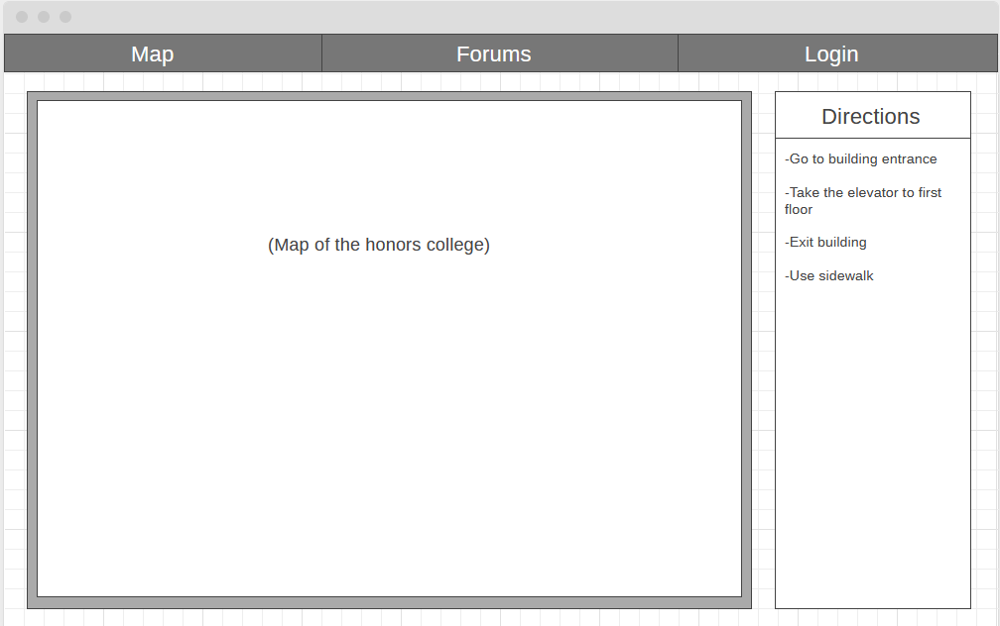
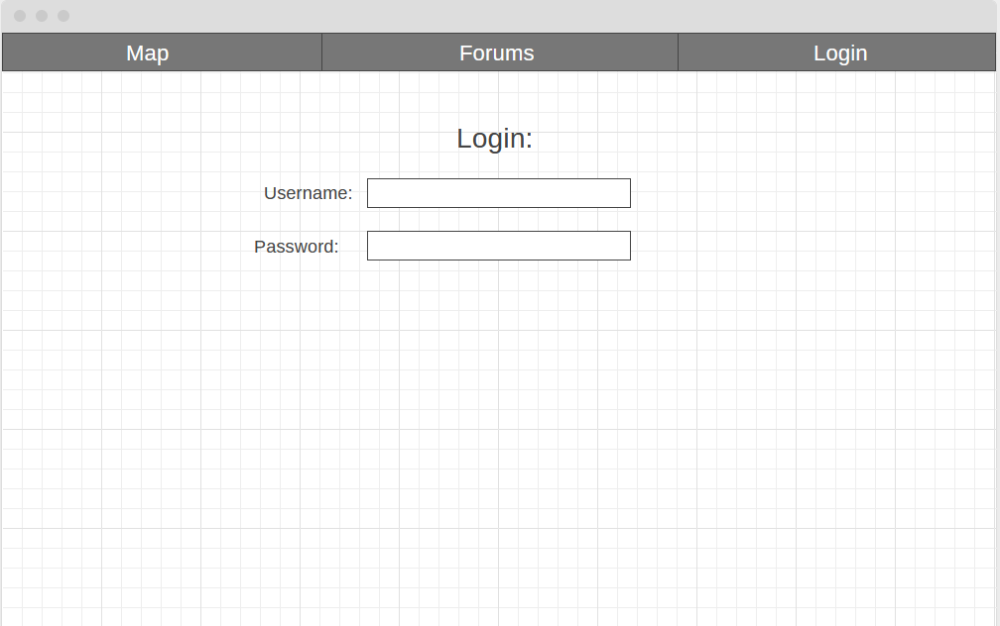
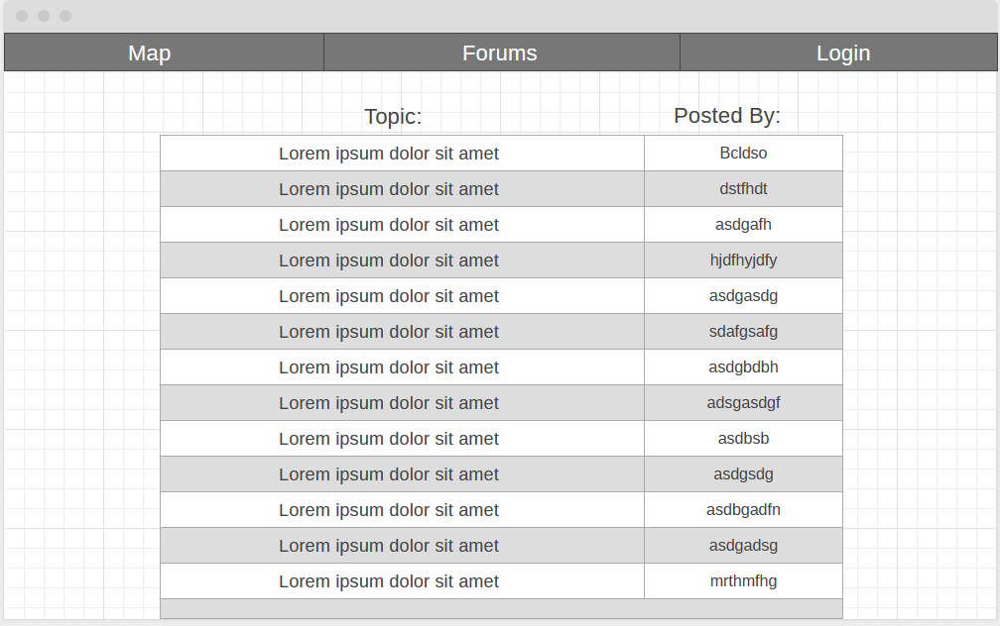
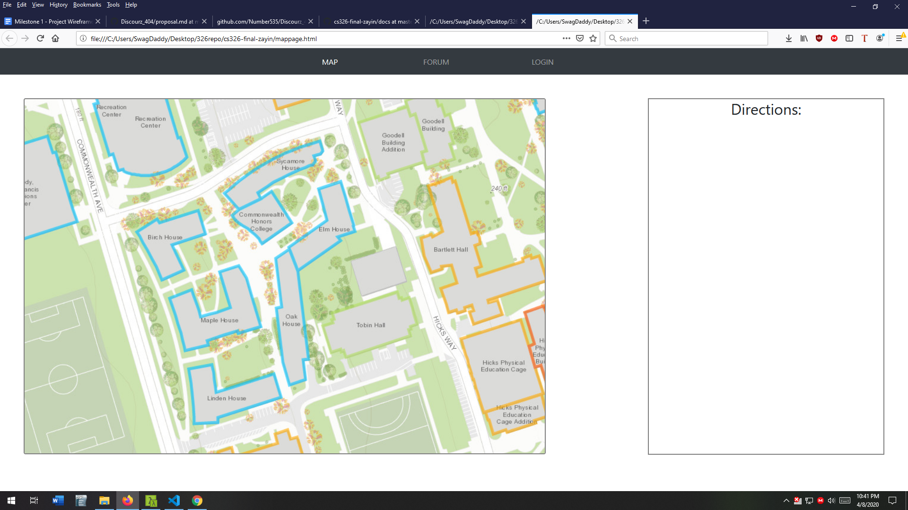
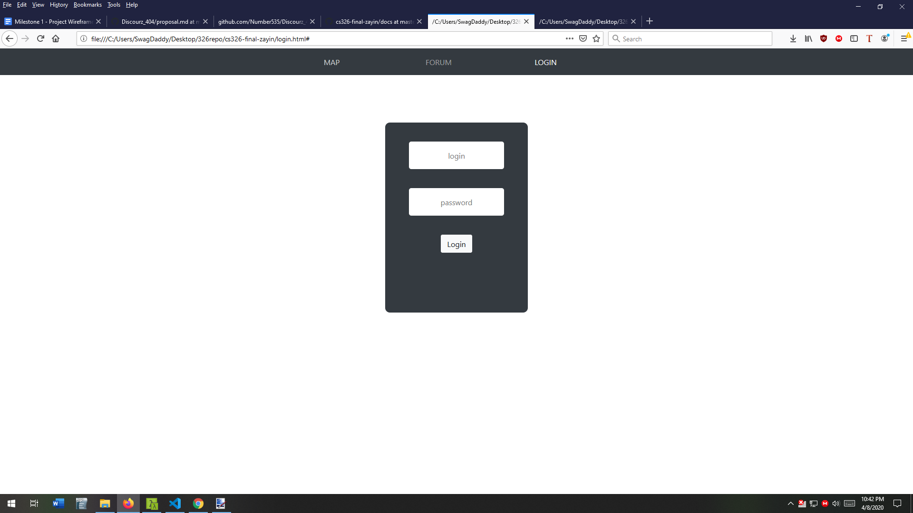
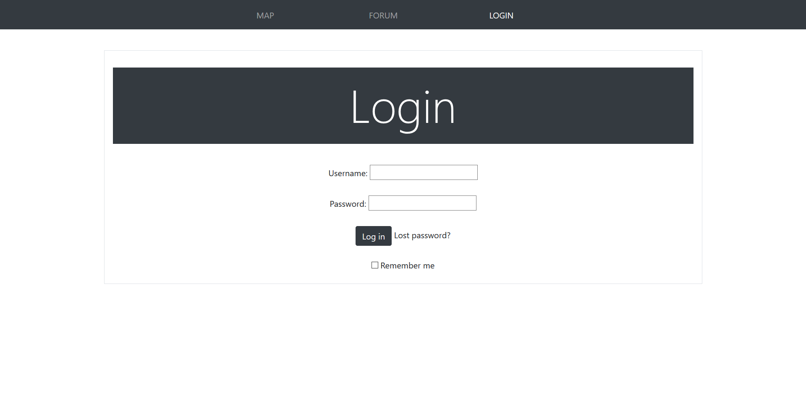
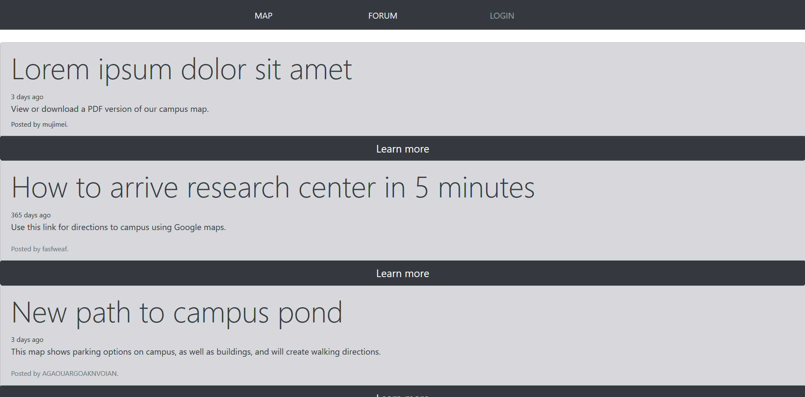
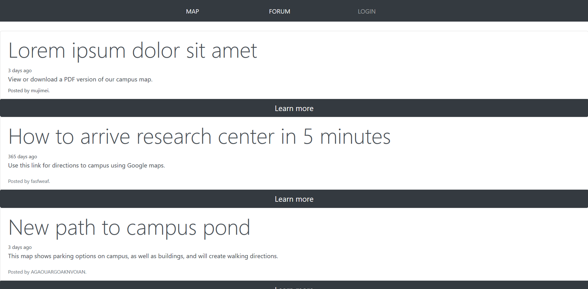

# Wireframes

The above image is the wireframe for the main page of the website. It has a navigation bar on top with links to the other parts of the website. There is a large map of the Honors College that users will use to select a point A and point B and see the best possible route. A directions box on the side will describe each step of the way.

This is the wireframe for the login page which is required to comment in the forums. 

This is the wireframe for the forums, where users can discuss different routes and ways of getting around campus in a wheelchair. 

# HTML and CSS

This is the current main page of the website, or the map page. It has the navigation bar up top. The map shows all the buildings and pathways in the Honors College. Users will click on two points of the map and a continuous line will appear between the two points, showing the path that will take the least amount of time for a wheelchair-bound person. The direction box will have text appear showing each step of the way.

This is the login page where users can input their information to login. 

(version 1)

(version 2)
This is the forum page where users can post their thoughts and information that they want to share.

# Division of Labor

Zack Kochanski - Created wireframes, created HTML and CSS pages, created markdown document. 

Mofei Xiao - Revised login content of the login.hmtl  and created content of forum.html.
